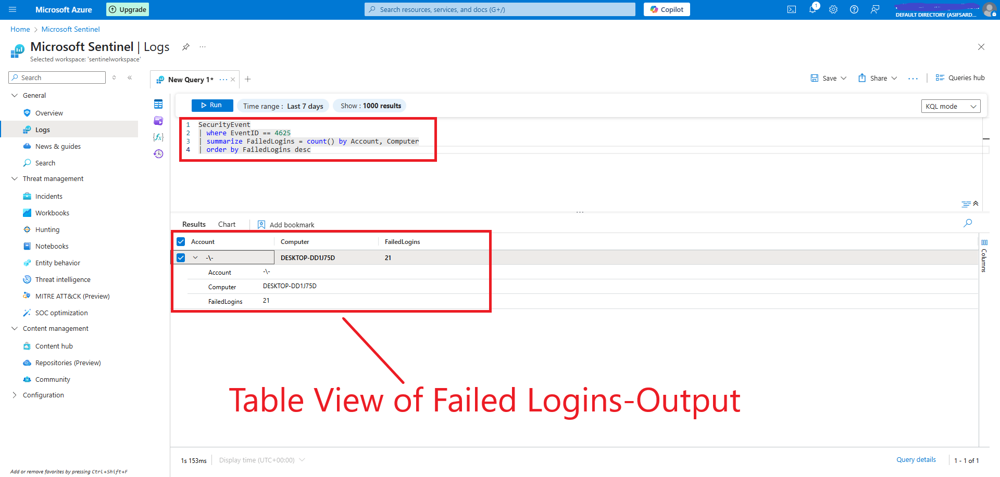
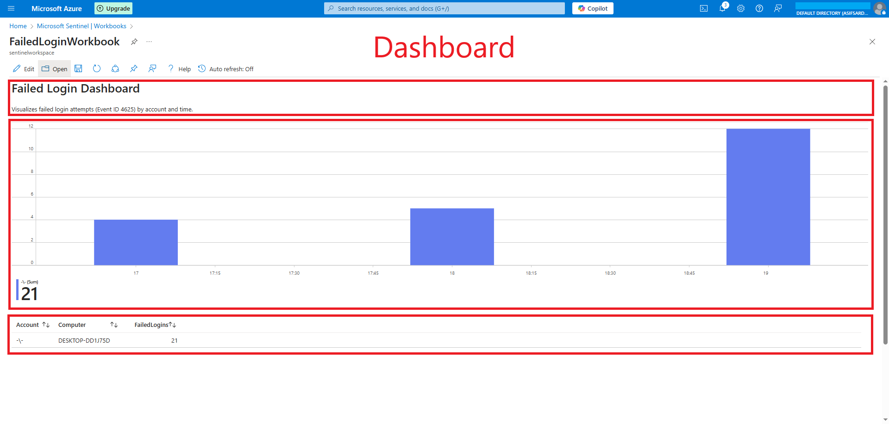

# 🔐 Microsoft Sentinel: Windows Security Event Monitoring

This project demonstrates how to detect and visualize Windows failed login attempts (Event ID 4625) using **Microsoft Sentinel**, **Kusto Query Language (KQL)**, and a **custom dashboard**. It showcases real-world **SOC analyst** skills, including log ingestion, query writing, alert configuration, and incident monitoring.

---

## 📌 Project Objectives

- Ingest Windows Security Events into Microsoft Sentinel
- Detect 5+ failed login attempts within a 5-minute window
- Create an analytics rule to generate alerts
- Build a dashboard to visualize failed login trends
- Demonstrate core log monitoring and alerting workflows

---

## 🛠️ Tools Used

- [Microsoft Azure (Free Tier)](https://azure.microsoft.com/)
- Microsoft Sentinel
- Log Analytics Workspace
- Windows 10/11 VM (via VirtualBox)
- Azure Arc
- Azure Monitor Agent (AMA)
- Kusto Query Language (KQL)

---

## ⚙️ Setup Steps

1. Created an Azure Free Account and set up a **Log Analytics Workspace**
2. Enabled **Microsoft Sentinel** and attached it to the workspace
3. Configured a **Windows 10 VM** in VirtualBox
4. Connected the VM to Sentinel using **Azure Arc + AMA**
5. Ingested Windows Security Logs (focusing on Event ID `4625`)
6. Wrote a KQL query to detect 5+ failed login attempts in 5 minutes
7. Created an **Analytics Rule** to generate alerts
8. Designed a **Sentinel Workbook** for visualizing failed logins over time

---

## 📊 Key KQL Queries

### Detect Failed Login Attempts (Analytics Rule)
```kql
SecurityEvent
| where EventID == 4625
| summarize FailedAttempts = count() by Account, Computer, bin(TimeGenerated, 5m)
| where FailedAttempts >= 5
| extend AccountName = tostring(Account), HostName = tostring(Computer)
```

### Visualize Failed Logins Over Time
```kql
SecurityEvent
| where EventID == 4625
| summarize FailedLogins = count() by bin(TimeGenerated, 1h), Account
| render columnchart
```

### Table View of Failed Logins
```kql
SecurityEvent
| where EventID == 4625
| summarize FailedLogins = count() by Account, Computer
| order by FailedLogins desc
```

---

## 📸 Screenshots

| Description                                      | Screenshot                     |
|--------------------------------------------------|--------------------------------|
| Detect Failed Login Attempts (Analytics Rule)    | |
| Visualize Failed Logins Over Time                | |
| Table View of Failed Logins                      | |
| Analytics Rule Setup                             | [](https://youtu.be/_uIQbRGGcY4) |
| Alert Triggered                                  | |
| Dashboard View                                   | |


---

## 📁 Project Structure

```
Microsoft-Sentinel-FailedLogin-Detection/
├── README.md
├── Report.pdf
├── queries/
│   └── FailedLoginQuery.kql
├── screenshots/
│   ├── 1.png
│   ├── 2.png
│   ├── 3.png
│   ├── alert1.png
│   ├── dashboard1.png
│   ├── temp.gif
│   └── yt1.png
```

---

## ✅ What I Learned

- Setting up Microsoft Sentinel and ingesting logs
- Writing and testing KQL queries
- Building and customizing Sentinel Analytics Rules
- Creating real-time dashboards with Workbooks
- Documenting security monitoring projects

---

## 🚀 Future Improvements

- Add rules for other critical Event IDs (e.g., 4740 - Account Lockouts)
- Set up Logic App playbooks for automated incident response
- Expand monitoring to multiple VMs and user profiles
- Add alert grouping and suppression logic for fine-tuning

---

## 📄 Deliverables

- Project Report (PDF)
- KQL Query Files
- Screenshots of setup and results
- GitHub repository (you're viewing it!)
- (Optional) Video Walkthrough [Insert link here]

---

## 🧠 MITRE ATT&CK Mapping

- **Tactic**: Credential Access
- **Technique**: Brute Force (T1110)

---

## 🙋‍♂️ Author

**MD. ASIF SARDAR**  
Cybersecurity Enthusiast | SOC Level 1 Trainee @TryHackMe | Hands-On Learner | Continuous Learner  
🔗 [LinkedIn Profile](https://www.linkedin.com/in/md-asif-sardar-386457296/)

---

## 📜 License

This project is licensed under the MIT License - see the [LICENSE](LICENSE) file for details.
